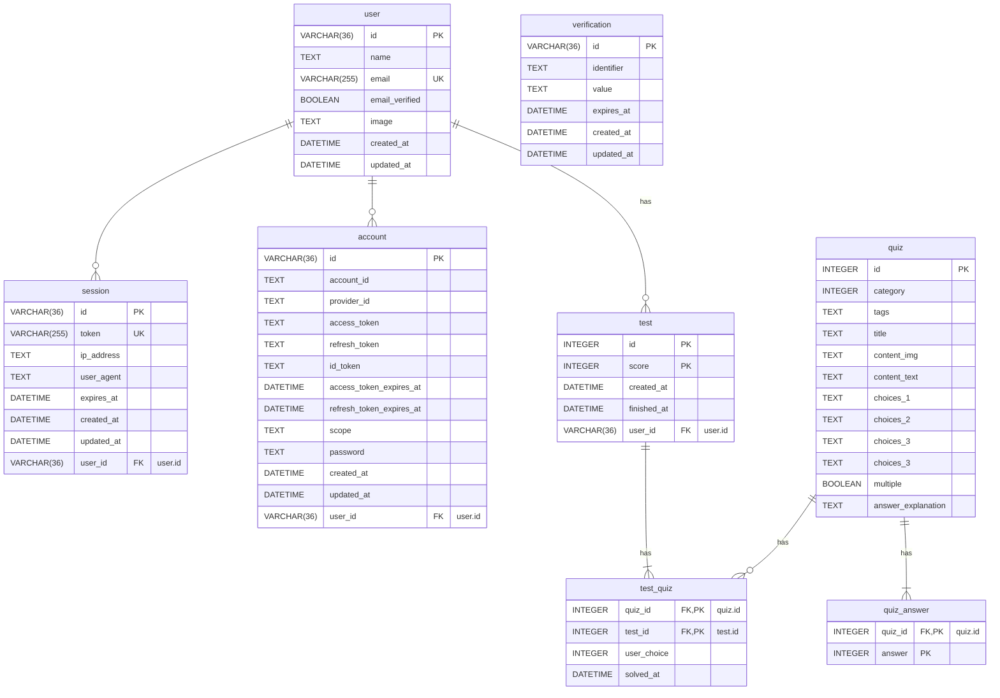

```mermaid

erDiagram
  user {
    VARCHAR(36) id PK
    TEXT name
    VARCHAR(255) email UK
    BOOLEAN email_verified
    TEXT image
    DATETIME created_at
    DATETIME updated_at
  }
  user ||--o{ session : ""
  session {
    VARCHAR(36) id PK
    VARCHAR(255) token UK
    TEXT ip_address
    TEXT user_agent
    DATETIME expires_at
    DATETIME created_at
    DATETIME updated_at
    VARCHAR(36) user_id FK "user.id"
  }
  verification {
    VARCHAR(36) id PK
    TEXT identifier
    TEXT value
    DATETIME expires_at
    DATETIME created_at
    DATETIME updated_at
  }
  user ||--o{ account : ""
  account {
    VARCHAR(36) id PK
    TEXT account_id
    TEXT provider_id
    TEXT access_token
    TEXT refresh_token
    TEXT id_token
    DATETIME access_token_expires_at
    DATETIME refresh_token_expires_at
    TEXT scope
    TEXT password
    DATETIME created_at
    DATETIME updated_at
    VARCHAR(36) user_id FK "user.id"
  }
  quiz {
    INTEGER id PK
    INTEGER category
    TEXT tags
    TEXT title
    TEXT content_img
    TEXT content_text
    TEXT choices_1
    TEXT choices_2
    TEXT choices_3
    TEXT choices_3
    BOOLEAN multiple
    TEXT answer_explanation
  }
  quiz ||--|{ quiz_answer : "has"
  quiz_answer {
    INTEGER quiz_id FK,PK "quiz.id"
    INTEGER answer PK
  }
  user ||--o{ test : "has"
  test {
    INTEGER id PK
    INTEGER score PK
    DATETIME created_at
    DATETIME finished_at
    VARCHAR(36) user_id FK "user.id"
  }
  test ||--|{ test_quiz : "has"
  quiz ||--o{ test_quiz : "has"
  test_quiz {
    INTEGER quiz_id FK,PK "quiz.id"
    INTEGER test_id FK,PK "test.id"
    INTEGER user_choice
    DATETIME solved_at
  }

```
