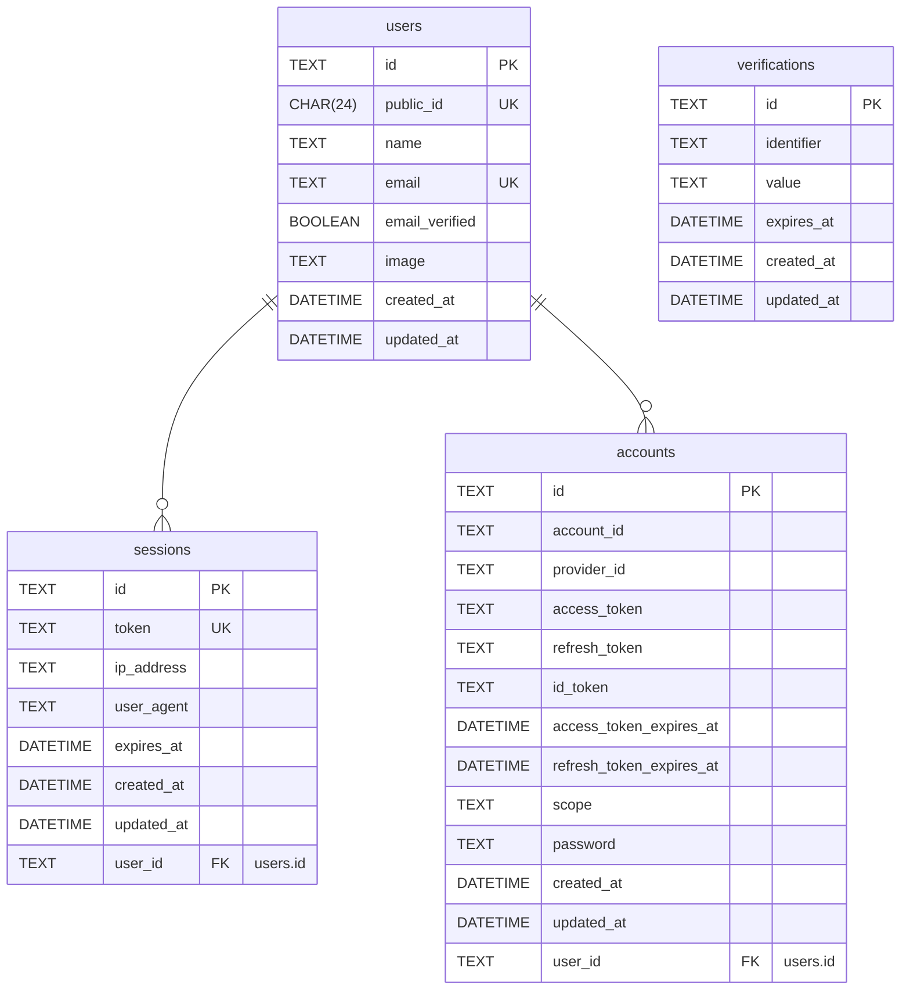

```mermaid

erDiagram
  users {
    TEXT id PK
    CHAR(24) public_id UK
    TEXT name
    TEXT email UK
    BOOLEAN email_verified
    TEXT image
    DATETIME created_at
    DATETIME updated_at
  }
  users ||--o{ sessions : ""
  sessions {
    TEXT id PK
    TEXT token UK
    TEXT ip_address
    TEXT user_agent
    DATETIME expires_at
    DATETIME created_at
    DATETIME updated_at
    TEXT user_id FK "users.id"
  }
  users ||--o{ accounts : ""
  accounts {
    TEXT id PK
    TEXT account_id
    TEXT provider_id
    TEXT access_token
    TEXT refresh_token
    TEXT id_token
    DATETIME access_token_expires_at
    DATETIME refresh_token_expires_at
    TEXT scope
    TEXT password
    DATETIME created_at
    DATETIME updated_at
    TEXT user_id FK "users.id"
  }
  verifications {
    TEXT id PK
    TEXT identifier
    TEXT value
    DATETIME expires_at
    DATETIME created_at
    DATETIME updated_at
  }

```
